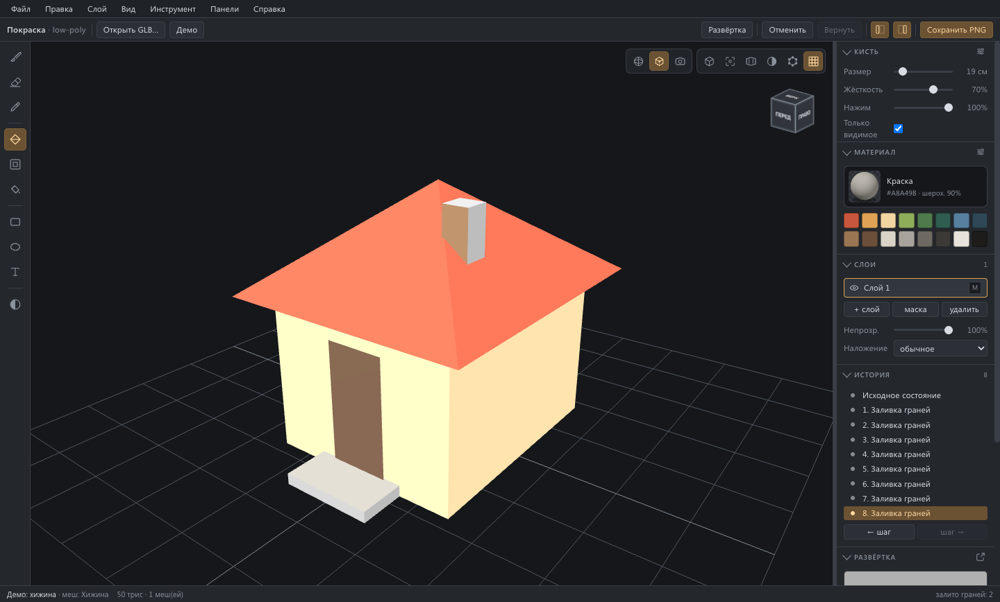

# 3DPainter — покраска по модели

**Красить low-poly модель кистью прямо по поверхности — руками, а не настройками.**

[English version](README.md) · [Лицензия MIT](LICENSE)



Открываете модель, крутите её и красите. Не нужно возиться с развёрткой,
открывать текстурный редактор и бегать между программами: щёлкнули по крыше —
покрасилась крыша. В конце инструмент отдаёт PNG, который кладётся обратно на
модель.

Работает в браузере; из того же кода собирается обычное приложение.

## Зачем он

Low-poly ассеты красят плоскими цветами: крыша, стена, дверь — каждая своим.
В большом текстурном пакете это тяжело: воюешь с развёрткой, с тем, что кисть
меняет размер по модели, и со швом, который режет мазок пополам.

Инструмент сделан ровно под эту узкую задачу и обещает три вещи:

- **Кисть одного размера по всей модели** — потому что это шар в пространстве
  модели, а не круг на текстуре.
- **Швов для вас не существует.** Мазок через шов развёртки просто
  продолжается: инструмент красит обе стороны разом.
- **Заливка останавливается там, где кончается форма.** «Залей крышу» не
  перетекает на стену: ребро переходится, только если излом достаточно мягкий.

## Скачать

Готовые сборки для macOS (Apple Silicon) и Windows приложены к каждому
[релизу](https://github.com/unibronga/3Dpainter/releases). Обе без подписи,
поэтому при первом запуске система спросит подтверждение — см.
[Установка собранного приложения](#установка-собранного-приложения).

Если хотите собрать сами — читайте дальше.

## Быстрый старт

Нужен [Node.js](https://nodejs.org/) 18 или новее.

```bash
git clone https://github.com/unibronga/3Dpainter.git
cd 3Dpainter
npm install
npm run dev
```

Откройте `http://localhost:5273`. Начальный экран предлагает два пути:
открыть свою модель или начать с демо-хижины и красить прямо сейчас. Ниже —
десяток последних моделей: строка выбирается, справа показывается превью, и
уже под ним кнопка «Открыть». Файл можно просто перетащить во вьюпорт.

### Какие форматы понимает

| Читает | Пишет |
|---|---|
| glTF / GLB, OBJ, FBX, Collada (DAE), 3MF, VRML | GLB, glTF, OBJ + MTL, карты PNG |
| STL, PLY, AMF — только геометрия, см. ниже | |

**Покраска требует развёртки, и если её нет — она строится.** glTF, OBJ, FBX,
DAE и 3MF развёртку несут, но несут по-разному: выгрузки из сети сплошь и
рядом кладут в канал UV плоскую проекцию геометрии, по которой красить нельзя.
Программа проверяет развёртку при открытии и, если её нет, она вне квадрата
0…1 или занимает считанные тексели, строит свою — острова по излому,
уложенные в атлас с одинаковой плотностью текселей. Об этом пишется в строке
состояния. Развёртку, которая в порядке, никто не трогает.

**Модель можно открыть вместе с тем, что лежит рядом.** В диалоге выбираются
несколько файлов, а папку можно просто бросить в окно. У `.obj` так
подхватывается соседний `.mtl`: цвета материалов ложатся первым слоем — модель
открывается такой, какой её задумал автор, и сразу правится кистью.

**Сохранение** предлагает ту развилку, которая и нужна: отдать карты или
отдать модель вместе с покраской — файл, который откроется в другом редакторе
уже покрашенным. GLB кладёт всё в один файл; OBJ выходит вместе с `.mtl` и
картой цвета рядом.

Остальные команды:

| Команда | Что делает |
|---|---|
| `npm run dev` | Сервер разработки на порту 5273 |
| `npm run desktop` | Собрать и запустить окном приложения |
| `npm run dist` | Собрать установщик в `release/` |
| `npm run icon` | Перерисовать значок (он рисуется кодом) |

## Управление

| Действие | Как |
|---|---|
| Красить | **ЛКМ** |
| Вращать | **ПКМ** |
| Двигать | **пробел + ЛКМ** или средняя кнопка |
| Зум | **колесо** |
| Размер кисти | **[** и **]** |
| Инструменты | **V** выбор объекта · **H** сдвиг · **O** вращение · **Z** зум · **B** кисть · **E** ластик · **I** пипетка · **F** заливка граней · **G** заливка острова · **L** лассо (ещё раз — по точкам) |
| Виды | **1**–**7** по осям · **0** три четверти · **5** перспектива ↔ ортография |
| Точка вращения | три значка над вьюпортом: мир, объект или **то, что в центре кадра** |
| Вписать в кадр | **Home** |
| Развёртка | **U** |
| Скрыть панели | **Tab** |
| Отмена / возврат | **Cmd+Z** / **Cmd+Shift+Z** |
| Выделить всё / снять / инвертировать | **Cmd+A** / **Cmd+D** / **Cmd+Shift+I** |

Подробная справка — [СПРАВКА.md](СПРАВКА.md) или **F1** в программе.

## Что умеет

**Инструменты.** Кисть с шестнадцатью пресетами (зерно, интервал, разброс),
ластик, пипетка, три заливки, лассо, прямоугольник, круг и текст
(с выбором шрифта — восемь системных). Параметры выбранного инструмента
появляются полоской над моделью слева. У вращения, например, там шаг поворота —
поставил галочку и 30°, и вид поворачивается ровно по 30°, — и кнопка сброса
вида.
Фигуры и текст печатаются проекцией на экран, поэтому прямоугольник остаётся
прямоугольником в кадре, как бы ни была изогнута поверхность под ним.

**Выделение лассо** — вольное и по точкам, как в Photoshop. Пока выделение
есть, любой инструмент красит только внутри: кисть, ластик, заливки,
фигуры — мазок можно смело вести через край. Shift добавляет, Alt вычитает,
Shift+Alt оставляет пересечение. На модели контур ложится проекцией с экрана,
сразу на все объекты; в развёртке обводится прямо по текстуре. Край виден
бегущим пунктиром.

**Материал, а не только цвет.** Материал здесь — цвет + узор + шероховатость
+ металл + прозрачность, и всё это красится по текселям. «Покрасить железом»
делает железной закрашенную область, а не модель целиком. Десять процедурных
узоров в комплекте, можно загрузить свою картинку.

**Слои и история.** Видимость, непрозрачность, режимы наложения. В истории можно щёлкнуть любой шаг и оказаться в нём, а не только
шагать назад по одному.

**Редактор развёртки** на полэкрана: весь набор инструментов работает прямо
по развёртке — кисть, заливки, пипетка, фигуры, текст и лассо. Удобно там, где грань
мелкая или спрятана на самой модели.

**Выдача.** PNG цветовой карты и, если красили поверхностью, вторая карта
`<имя>_material.png` (шероховатость в зелёном канале, металл в синем —
стандартная упаковка, которую three.js читает напрямую): маленькая кнопка
**PNG** под списком развёрток сохраняет открытую, **Файл ▸ Сохранить PNG** —
все разом. Либо вся модель вместе с покраской — **Файл ▸ Сохранить как…**.
А **Вид в PNG** снимает модель ровно в том ракурсе, что во вьюпорте, на
прозрачном фоне — с размером и сглаживанием края на выбор.

**Настройки** (Файл ▸ Настройки…) держат язык интерфейса, масштаб интерфейса
(80–200%: текст, значки, панели и окна растут разом — для больших экранов),
размер текстуры по умолчанию и показ начального экрана при запуске.

**Долгие операции** — открытие модели, сохранение, пересборка текстур — идут
под индикатором: видно, что программа занята.

**Языки.** Интерфейс целиком говорит по-русски и по-английски и
переключается на лету — покраска при этом не теряется. Словари лежат по
файлу на язык в `src/lang/`, ключи плоские вида `'раздел.имя'`; добавить
язык — значит добавить файл и строчку в `LANGS`, не трогая остальной код.
Комментарии в коде остаются русскими.

## Как устроено

Всё держится на трёх решениях:

1. **Кисть — шар в пространстве модели, а не круг на текстуре.** Для каждого
   треугольника, попавшего в шар, считаются его тексели, и для каждого текселя
   восстанавливается точка на поверхности. Отсюда одинаковый размер мазка по
   всей модели и швы, которые проходятся сами.
2. **Промежутки между событиями мыши добиваются шагами по экрану**, с новым
   лучом на каждом шаге. Интерполяция по прямой в пространстве протащила бы
   кисть сквозь объём модели и мазала бы по дальним стенам изнутри.
3. **Накопленное переносится в текстуру раз в кадр.** За один взмах мыши
   отпечатков ставятся десятки, и каждая сборка стоит полной перезаливки
   текстуры на видеокарту.

Полный технический разбор — [docs/АРХИТЕКТУРА.md](docs/АРХИТЕКТУРА.md).

## Известное ограничение: развёртка с наложением

Если две далёкие грани делят одни и те же тексели, покрасить модель
по-человечески нельзя: мазок по одной стене проступит на другой, а кисть
оставит обрезки вместо круглого следа. Так ведут себя примитивы
(`BoxGeometry` кладёт все шесть граней в один квадрат) и зеркальные развёртки.

Инструмент считает долю наложения при загрузке и **предупреждает красным** в
строке состояния. Лечится на стороне моделирования: Smart UV Project или
ручная развёртка в Blender.

## Состояние и планы

Рабочая версия 0.4.0. Новое в 0.4.0: выделение лассо — вольное и по точкам,
масштаб интерфейса для больших экранов, подсказки у каждого элемента, шаг
поворота у вращения, **Вид в PNG** и сохранение открытой развёртки отдельно.
Ещё не сделано:

- Сохранение сессии покраски (слои) — сейчас выпекается только итоговый
  PNG, вернуться к работе на следующий день нельзя.
- Читать текстуру, которая пришла с моделью: цвета из `.mtl` подхватываются,
  а готовая картинка из GLB — пока нет.
- Перекрытие для фигур, текста и лассо: отвёрнутые грани отсекаются, но труба
  не даёт «тень» на крышу за собой.
- Перетаскивание порядка слоёв и копирование слоя; симметрия, мазок по прямой,
  стабилизация линии.
- Выделение островов и показ швов в редакторе развёртки.
- Сборка под macOS **не подписана** — см. ниже.

## Установка собранного приложения

`npm run dist` кладёт `.dmg` в `release/`. Приложение не подписано
сертификатом разработчика Apple, поэтому при первом запуске macOS скажет, что
не может проверить разработчика. Обойти: правой кнопкой по значку →
**«Открыть»** → **«Открыть»**, либо один раз снять карантин:

```bash
xattr -dr com.apple.quarantine /Applications/3DPainter.app
```

Сборки под Windows и Linux описаны в `electron-builder.yml`. Установщик под
Windows на macOS не собрать — NSIS там требует Wine, — поэтому каждая система
собирает себя сама: `.github/workflows/release.yml` запускает сборку macOS и
Windows на своих машинах и прикладывает результат к релизу.

В Windows при первом запуске SmartScreen покажет предупреждение:
**«Подробнее»** → **«Выполнить в любом случае»**.

## Как помочь проекту

Задачи и пулл-реквесты приветствуются. Что стоит знать:

- Код и комментарии — на русском. Вклад на любом языке принимается, но
  комментарии лучше писать на языке того файла, который правите.
- Инструмент нарочно узкий: он красит готовые модели. Моделирование, риг и
  анимация — не его дело.
- Это графическая программа, и «должно работать» здесь не значит ничего.
  Проверяйте правку на экране и читайте числа из строки состояния (доля
  наложения, время сборки кадра, размер кисти в сантиметрах).

## Лицензия

[MIT](LICENSE) © 2026 Kostiantyn
